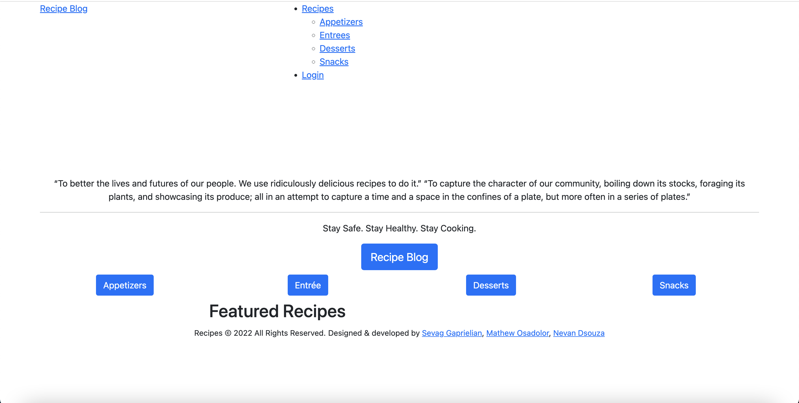

# UofT-SCS-Coding-Bootcamp-Project-2

## Hi There! 👋🏼 Welcome to our Recipe Blog

### Languages and Tools Used:

  

 

 
 

## Table of Contents
* [Description](#desc)  
* [Installation](#install)  
* [Usage](#usage)  
* [Credits](#credits)  
* [License](#license)  
* [Github](#github)  

## Description

The purpose of this project was to develop a full-stack application. Our group decided to build a Recipe Blog to foster community among people who are avid food lovers, and those who want to get into cooking. The blog features recipes divided by categories, which are viewable by anyone visiting the page. The blog also allows users to create an account to add their own recipes, and comment on the recipes of other users!

## Installation
Clone the repository, and create a .env file. In the file include the following:  

* DB_NAME=recipes_db
* DB_USER=root
* DB_PW= 'your MySQL password to connect to the MySQL server'  

Run npm install to install the necessary mysql2, express, dotenv, and sequelize packages. Login to your MySQL shell in the command line, and run the schema. Exit the MySQL shell and seed the databse by running the node seeds/seed.js command. Once complete run the npm start command to start the application.
 
 
## Usage
The following image shows the application's appearance and functionality.

The application should appear as follows after successfully loading:

## Credits
Uoft SCS Coding Bootcamp Gitlab

 
## License
Copyright [2022] [Sevag Gaprielian]

Licensed under the Apache License, Version 2.0 (the "License"); you may not use this file except in compliance with the License.
You may obtain a copy of the License at http://www.apache.org/licenses/LICENSE-2.0.

Unless required by applicable law or agreed to in writing, software
distributed under the License is distributed on an "AS IS" BASIS,
WITHOUT WARRANTIES OR CONDITIONS OF ANY KIND, either express or implied.
See the License for the specific language governing permissions and
limitations under the License.

The URL of the GitHub repository. (https://github.com/sevaggap/Recipe-Blog)

Deployed Application. (https://aqueous-dusk-06915.herokuapp.com/)

Link to our presentation. (https://docs.google.com/presentation/d/1Ix3WR2SJk3R7zpXetRYYMQezy-_mNgfOOiOaSsN9mVY/edit?usp=sharing)

Screenshot/Demo

